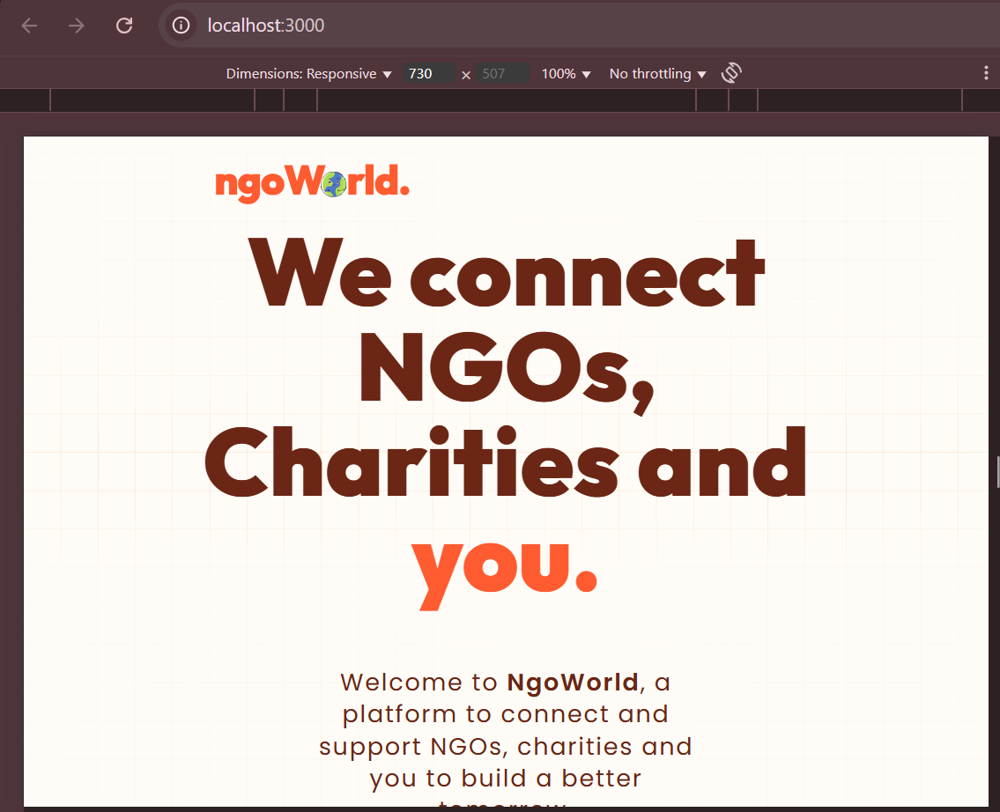
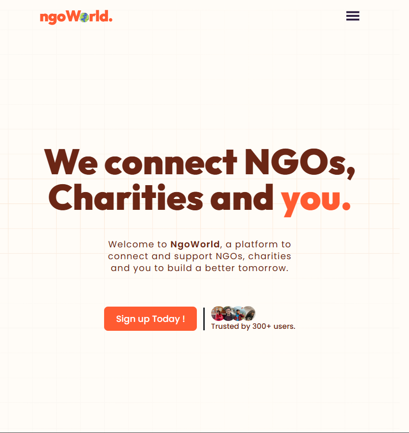

# NGOWorld Open Source Contribution

This folder contains the report and assets for my open source contribution to the NGOWorld project.

## Contents

- `report.md`: Comprehensive report of the contribution
 Screenshot showing the navbar issue before the fix

 Screenshot showing the navbar after the fix

## Assignment Details

This contribution was made as part of the "Open Source Contributor" assignment, which required:
1. Finding an open-source project
2. Analyzing and understanding the codebase
3. Identifying and fixing issues
4. Creating a pull request
5. Documenting the process

## How to View the Report

The report is available in Markdown format. You can view it directly on GitHub or using any Markdown viewer. For the best experience, view the `report.md` file with a Markdown viewer that supports syntax highlighting. 