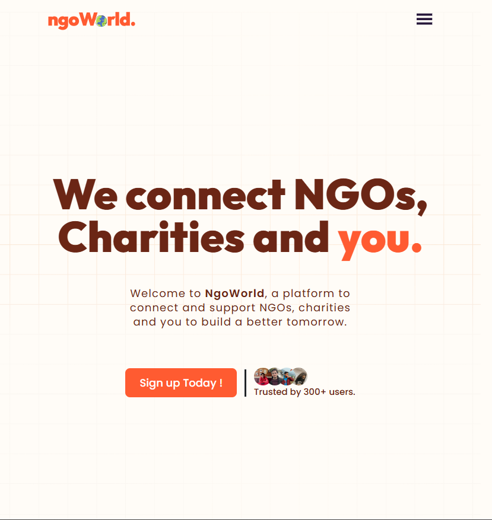

# Open Source Contribution Report

## Project Overview: NGOWorld

NGOWorld is an open-source platform designed to connect NGOs, charities, and individuals to collaborate and build a better tomorrow. The project aims to provide a hub where organizations can showcase their work, events, and initiatives, while users can discover and engage with causes they care about.

### Tech Stack
- **Frontend**: React.js, SCSS, Material UI
- **State Management**: Redux, Zustand
- **Routing**: React Router
- **API Integration**: Axios, React Query
- **UI Components**: Custom components, Material UI

## Bug Fixes and Contributions

### Issue 1: Incorrect Login Path in Footer

**Problem**: The footer's "Login / Signup" link was pointing to `/auth/login`, but the actual route defined in the application was `/auth/signin`.

**Solution**: Updated the path in the footerLinksConfig.js file to correctly point to `/auth/signin`.

**Before**:
```javascript
{ name: "Login / Signup", path: "/auth/login" }
```

**After**:
```javascript
{ name: "Login / Signup", path: "/auth/signin" }
```

### Issue 2: Navbar Responsiveness

**Problem**: The navbar was not displaying properly for screen widths between 430px and 900px. The full navigation menu was only visible for screens wider than 900px, and the mobile hamburger menu was only visible for screens narrower than 430px, leaving a gap where no navigation was accessible.

**Solution**: Modified the Navbar component and its styles to ensure the hamburger menu is visible for all screen widths up to 900px.

**Before (Navbar.jsx)**:
```jsx
{!isNavbarOpen &&
  (Cookies.get("Token") ? (
     {
        toggleNavbar();
      }}
    />
  ) : (
    <GiHamburgerMenu
      className="navbar_ham"
      onClick={() => {
        toggleNavbar();
      }}
    />
  ))}
```

**After (Navbar.jsx)**:
```jsx
{windowWidth <= 900 && !isNavbarOpen &&
  (Cookies.get("Token") ? (
     {
        toggleNavbar();
      }}
    />
  ) : (
    <GiHamburgerMenu
      className="navbar_ham"
      onClick={() => {
        toggleNavbar();
      }}
    />
  ))}
```

**Before (Navbar.scss)**:
```scss
.navbar_ham {
  width: 30px;
  height: 30px;
  color: #28183b;
  cursor: pointer;
  display: none;

  @media screen and (max-width: 430px) {
    display: block;
  }
}

.navbar_hamimg {
  width: 30px;
  height: 30px;
  cursor: pointer;
  display: none;
  border-radius: 50%;

  @media screen and (max-width: 430px) {
    display: block;
  }
}
```

**After (Navbar.scss)**:
```scss
.navbar_ham {
  width: 30px;
  height: 30px;
  color: #28183b;
  cursor: pointer;
  display: none;

  @media screen and (max-width: 900px) {
    display: block;
  }
}

.navbar_hamimg {
  width: 30px;
  height: 30px;
  cursor: pointer;
  display: none;
  border-radius: 50%;

  @media screen and (max-width: 900px) {
    display: block;
  }
}
```

## Screenshots

### Before Fix (Navbar Issue)

*Navbar elements not visible between 430px and 900px screen width*

### After Fix (Navbar Issue)

*Hamburger menu now visible for all screen widths up to 900px*

## Cursor Workflow and How It Helped

Cursor, as an AI-powered IDE, significantly enhanced my workflow in understanding and contributing to this unfamiliar codebase:

1. **Codebase Navigation**: Cursor helped me quickly navigate through the project structure and understand the relationships between different components.

2. **Issue Identification**: Using Cursor's code search and analysis capabilities, I was able to identify the root causes of the bugs efficiently.

3. **Context-Aware Suggestions**: When modifying the Navbar component, Cursor provided context-aware suggestions that helped ensure my changes were consistent with the existing codebase style and patterns.

4. **Refactoring Assistance**: Cursor assisted in refactoring the CSS media queries by suggesting the appropriate changes needed to fix the responsiveness issues.

5. **Documentation Support**: Cursor helped me document my changes clearly and create this comprehensive report by providing structured templates and formatting suggestions.

## GitHub Repository

- **Original Repository**: [NGOWorld](https://github.com/ngoworldcommunity/NGOWorld)
- **Forked Repository**: [Your GitHub username]/NGOWorld
- **Pull Request URL**: https://github.com/ngoworldcommunity/NGOWorld/pull/1303


## Conclusion

Contributing to NGOWorld was a valuable experience in understanding how to navigate and contribute to an unfamiliar codebase. The bugs I fixed, while seemingly small, had a significant impact on the user experience, especially for users with specific screen sizes. This contribution demonstrates the importance of responsive design and proper routing in web applications.

Using Cursor as a tool for this process significantly reduced the time needed to understand the codebase structure and identify the issues. It provided intelligent suggestions and helped ensure that my contributions maintained the project's coding style and conventions. 